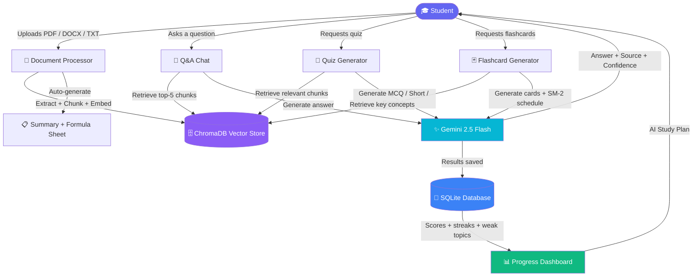
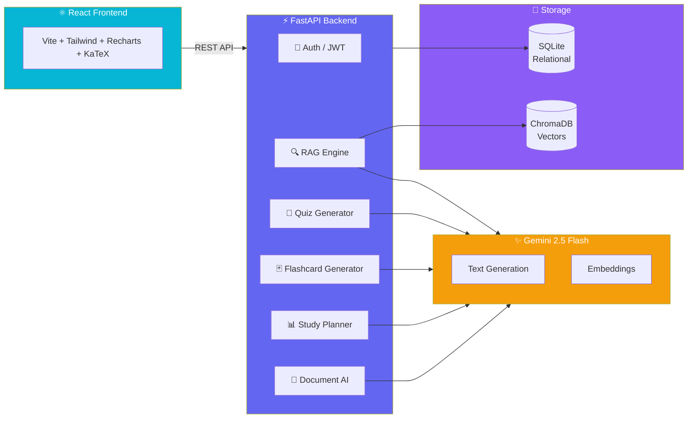

# 🧠 StudyBuddy AI

### AI-Powered Study Assistant for Engineering Students


> Upload your lecture notes → Ask questions → Generate quizzes → Study with flashcards → Track your progress. All powered by Gemini AI, RAG, and spaced repetition.

---

## 📌 What is StudyBuddy?

Most engineering students read their notes passively and forget most of it within a week. StudyBuddy fixes this by turning static study material into an interactive, AI-powered knowledge base.

Upload PDF, DOCX, or TXT files, organize them into subject folders, and StudyBuddy builds a RAG pipeline on top of them — letting you ask questions, generate quizzes, build flashcards, extract formula sheets, and get an AI-generated study plan, all grounded in your own material.

---

## 🎬 How It Works



---

## ✨ Features

### 📁 Subject-Organized Documents
- Upload PDF, DOCX, and TXT files
- Create color-coded subject folders (e.g. DSA, OS, Maths)
- Drag-and-drop upload with live progress
- Slide-over preview panel for each document

### 🤖 AI Document Intelligence
- Auto-generated summary on every upload
- One-click formula sheet extraction (every equation in a document, organized)
- AI-generated overview of an entire subject's documents
- Export summaries and formula sheets as branded PDFs

### 💬 RAG-Powered Q&A Chat
- Answers grounded strictly in your uploaded material
- Source citations — document name and page number on every answer
- Confidence indicator — High / Medium / Low
- Multi-turn conversation memory, multiple saved sessions
- LaTeX formula rendering for engineering equations

### 📝 Quiz Generator
- Three types — MCQ, Short Answer, Formula Recall
- Three difficulty levels — Easy, Medium, Hard
- Timed exam mode with countdown timer and auto-submit
- Gemini evaluates short answers with detailed feedback
- Results exportable as a branded PDF report

### 🃏 Flashcard System
- AI-generated flashcards from your uploaded material
- SM-2 spaced repetition algorithm — same as Anki
- Cards scheduled based on how well you knew them
- Due-today queue, session summary with stats

### 📊 Progress Dashboard
- Topic accuracy bar chart + radar visualization
- AI-generated personalized study plan based on weak topics and due cards
- Study streak tracker with weekly visual
- 30-day activity heatmap
- Full progress report exportable as PDF

### 🎨 Premium UI
- Indigo + Cyan design system
- Full dark / light mode support
- Collapsible sidebar with persistent state
- Three-column dashboard layout with live study score gauge

---

## 🏗️ System Architecture



---

## 🔄 RAG Pipeline

1. **Upload** — Student uploads PDF / DOCX / TXT, optionally into a subject folder
2. **Extract** — PyMuPDF and python-docx extract text page by page
3. **Chunk** — Text split into 512-token chunks with 64-token overlap
4. **Embed** — Gemini text-embedding-004 converts each chunk to a vector
5. **Store** — Vectors saved in ChromaDB with document name and page metadata
6. **Summarize** — Gemini auto-generates a structured summary from the chunks
7. **Query** — Student question converted to a query embedding
8. **Retrieve** — Top-5 most similar chunks fetched by cosine similarity
9. **Generate** — Gemini 2.5 Flash generates an answer using retrieved chunks as context
10. **Cite** — Every answer shows source document, page number, and confidence score

---

## 📈 Spaced Repetition — SM-2 Algorithm

Flashcards use the SM-2 algorithm — the same one used by Anki:

| Quality | Meaning | What happens |
|---|---|---|
| 0 | Complete blackout | Reset — review tomorrow |
| 1 | Wrong, recognized answer | Reset — review tomorrow |
| 2 | Wrong but easy recall | Reset — review soon |
| 3 | Correct with effort | Interval increases slowly |
| 4 | Correct with hesitation | Interval increases |
| 5 | Perfect recall | Long interval, ease factor goes up |

Ease factor never drops below 1.3. Due cards always shown on the dashboard.

---

## 🛠️ Tech Stack

| Layer | Technology | Purpose |
|---|---|---|
| LLM | Gemini 2.5 Flash | Text generation, quiz, flashcards, summaries |
| Embeddings | Gemini text-embedding-004 | Document and query vectorization |
| Vector DB | ChromaDB | Semantic similarity search |
| RAG Framework | LangChain | Document chunking pipeline |
| Backend | FastAPI + Python 3.11 | REST API |
| Database | SQLite + SQLAlchemy | Users, subjects, documents, quizzes, flashcards, chats |
| Frontend | React 18 + Vite | User interface |
| Styling | Tailwind CSS | Indigo + Cyan design system |
| Charts | Recharts | Progress visualization, radar, bar, line |
| PDF Export | jsPDF + jspdf-autotable | Quiz reports, study plans, summaries, formula sheets |
| Icons | Tabler Icons | Icon system |
| Auth | JWT + bcrypt | Secure user sessions |
| PDF Parsing | PyMuPDF | Text extraction from PDFs |
| Spaced Repetition | SM-2 Algorithm | Flashcard scheduling |
| Evaluation | RAGAS-style metrics | RAG quality measurement |

---

## 🚀 Getting Started

### Prerequisites
- Python 3.11+
- Node.js 20+
- Gemini API key from [Google AI Studio](https://aistudio.google.com/app/apikey)

### 1. Clone the repository
```bash
git clone https://github.com/Twarit01/StudyBuddy.git
cd StudyBuddy
```

### 2. Backend setup
```bash
cd backend

# Create virtual environment
python3.11 -m venv venv
source venv/bin/activate

# Install dependencies
pip install -r requirements.txt
pip install "pydantic[email]"
pip install "bcrypt==4.0.1"

# Configure environment
cp .env.example .env
# Open .env and add your GEMINI_API_KEY
```

### 3. Frontend setup
```bash
cd frontend
npm install
```

Add the app logo to `frontend/public/studybuddy-logo.png`.

### 4. Run the application

**Option A — One command (recommended)**

From the project root:
```bash
npm install
npm run dev
```

This starts both backend and frontend together with color-coded logs.

**Option B — Run separately**

**Terminal 1 — Backend:**
```bash
cd backend
source venv/bin/activate
uvicorn main:app --reload
```

**Terminal 2 — Frontend:**
```bash
cd frontend
npm run dev
```

### 5. Open in browser