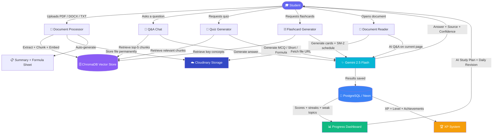
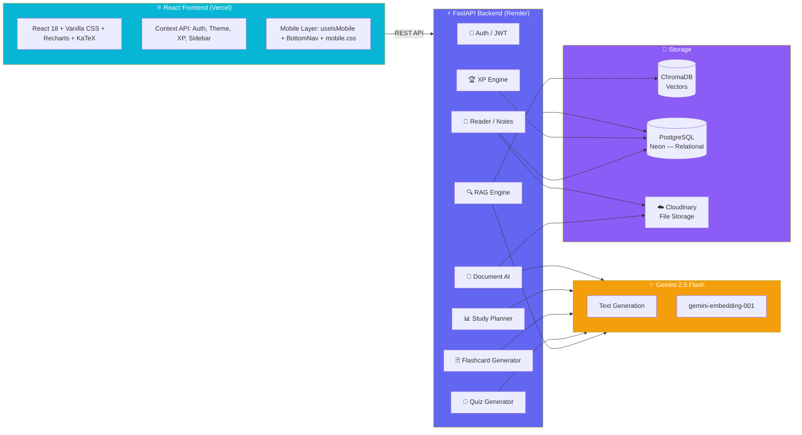

# 🧠 StudyBuddy AI

### AI-Powered Study Assistant for Engineering Students


> Upload your lecture notes → Ask questions → Generate quizzes → Study with flashcards → Track your progress → Earn XP. All powered by Gemini AI, RAG, and spaced repetition.

🔗 **Live Demo:** [ai-studybuddyy.vercel.app](https://ai-studybuddyy.vercel.app)

---

## 📌 What is StudyBuddy?

Most engineering students read their notes passively and forget most of it within a week. StudyBuddy fixes this by turning static study material into an interactive, AI-powered knowledge base.

Upload PDF, DOCX, or TXT files, organize them into subject folders, and StudyBuddy builds a RAG pipeline on top of them — letting you ask questions, generate quizzes, build flashcards, extract formula sheets, read documents with an AI assistant, get a daily revision plan, and earn XP — all grounded in your own material.

---

## 🎬 How It Works



---

## ✨ Features

### 📁 Subject-Organized Documents
- Upload PDF, DOCX, and TXT files
- Create color-coded, emoji-tagged subject folders (e.g. 🔵 DSA, 🟢 OS, 🟡 Maths)
- Live upload progress bar with chunking status
- Slide-over preview panel per document with full metadata
- Assign documents to subjects, reassign anytime

### 🤖 AI Document Intelligence
- Auto-generated structured summary on every upload
- One-click formula sheet extraction (every equation in a document, organized)
- AI-generated overview of an entire subject's documents
- Export summaries and formula sheets as branded PDFs

### 📖 Document Reader
- Built-in PDF and plain-text reader — no external app needed
- Page-by-page navigation with zoom controls (50%–200%)
- In-document text search with match highlighting and result navigation
- Read progress tracker (% read per document, persisted across sessions)
- AI Assistant panel — ask questions about the current page/document
- Highlight any text → instantly ask AI about the selection
- Notes panel — create, view, and manage page-specific study notes
- Resume reading from exactly where you left off

### 💬 RAG-Powered Q&A Chat
- Answers grounded strictly in your uploaded material
- Source citations — document name and page number on every answer
- Confidence indicator — High / Medium / Low
- Multi-turn conversation memory, multiple saved sessions
- Suggested follow-up questions after every answer
- LaTeX formula rendering for engineering equations
- Document scope selector — chat about all docs or a specific file

### 📝 Quiz Generator
- Three types — MCQ, Short Answer, Formula Recall
- Three difficulty levels — Easy, Medium, Hard
- Configurable question count and topic filter
- Timed exam mode with countdown timer and auto-submit
- Gemini evaluates short answers with detailed line-by-line feedback
- Results exportable as a branded PDF report
- Weak topics automatically flagged and fed into the study plan

### 🃏 Flashcard System
- AI-generated flashcards from your uploaded material
- SM-2 spaced repetition algorithm — same as Anki
- Quality rating 0–5 on each card (Blackout → Perfect)
- Cards scheduled based on how well you knew them
- Due-today queue, session summary with known/learning counts
- Study mode and management mode (view/edit/delete)

### 🔄 Daily Revision Hub
- Smart daily revision plan combining:
  - Flashcards due today (SM-2 scheduled)
  - Questions you got wrong in past quizzes
  - Your single weakest topic highlighted
- Completion tracker showing today's revision progress
- Prevents revision fatigue by only showing what's actually due

### 📊 Analytics & Progress
- Topic accuracy bar chart + radar visualization
- AI-generated personalized study plan based on weak topics and due cards
- Study streak tracker with weekly visual calendar
- 30-day activity heatmap
- Full progress report exportable as PDF

### 🏆 XP & Gamification System
- Earn XP for every action: quiz completion, flashcard sessions, reading, chatting
- Level up with increasing XP thresholds
- XP toast notifications — animated pop-ups on every reward
- Streak multiplier — longer study streaks = more XP per action
- Weekly XP bar displayed in the sidebar

### 🎨 Premium UI / UX
- Deep dark design system (`#0C0C14` base, indigo + cyan accents)
- Collapsible sidebar with persistent collapsed state
- Smooth animated transitions throughout
- LaTeX rendering via KaTeX for all mathematical content
- Recharts-powered analytics visualizations

### 📱 Mobile Responsive (Full Feature Parity)
- Complete mobile experience — every desktop feature works on phone
- Fixed bottom navigation bar (Home, Chat, Quiz, Cards, Docs, More)
- Sidebar transforms into a full-height overlay drawer on mobile
- All page layouts reflow to single-column on narrow screens
- Touch-optimized with 44px minimum tap targets
- Safe area inset support for notched iPhones
- `100dvh` viewport — no content hidden behind mobile browser chrome

---

## 🏗️ System Architecture



---

## 🔄 RAG Pipeline

1. **Upload** — Student uploads PDF / DOCX / TXT, optionally into a subject folder
2. **Extract** — PyMuPDF and python-docx extract text page by page
3. **Chunk** — Text split into 512-token chunks with 64-token overlap
4. **Embed** — Gemini `gemini-embedding-001` converts each chunk to a vector
5. **Store** — Vectors saved in ChromaDB with document name and page metadata
6. **Cloud Upload** — Original file uploaded to Cloudinary for persistent storage
7. **Summarize** — Gemini auto-generates a structured summary from the chunks
8. **Query** — Student question converted to a query embedding
9. **Retrieve** — Top-5 most similar chunks fetched by cosine similarity
10. **Generate** — Gemini 2.5 Flash generates an answer using retrieved chunks as context
11. **Cite** — Every answer shows source document, page number, and confidence score

---

## 📈 Spaced Repetition — SM-2 Algorithm

Flashcards use the SM-2 algorithm — the same one used by Anki:

| Quality | Meaning | What happens |
|---|---|---|
| 0 | Complete blackout | Reset — review tomorrow |
| 1 | Wrong, recognized answer | Reset — review tomorrow |
| 2 | Wrong but easy recall | Reset — review soon |
| 3 | Correct with effort | Interval increases slowly |
| 4 | Correct with hesitation | Interval increases |
| 5 | Perfect recall | Long interval, ease factor goes up |

Ease factor never drops below 1.3. Due cards always shown on the dashboard and revision hub.

---

## 🏆 XP System

| Action | XP Earned |
|---|---|
| Complete a quiz | 50–150 XP (scales with score) |
| Flashcard session | 10 XP per card reviewed |
| Chat message answered | 5 XP |
| Reading a document page | 2 XP |
| Daily login streak | Streak multiplier applied |

XP is persisted per user. Level thresholds increase progressively (e.g. Level 1 = 100 XP, Level 2 = 250 XP, ...).

---

## 🛠️ Tech Stack

| Layer | Technology | Purpose |
|---|---|---|
| LLM | Gemini 2.5 Flash | Text generation, quiz, flashcards, summaries, study plans |
| Embeddings | Gemini gemini-embedding-001 | Document and query vectorization |
| Vector DB | ChromaDB | Semantic similarity search |
| RAG Framework | LangChain | Document chunking pipeline |
| Backend | FastAPI + Python 3.11 | REST API |
| Database | PostgreSQL (Neon) + SQLAlchemy | Users, subjects, documents, quizzes, flashcards, chats, XP, notes |
| File Storage | Cloudinary | Persistent uploaded file storage (survives server restarts) |
| Frontend | React 18 + Vite 5 | User interface |
| Styling | Vanilla CSS + custom design system | Dark mode, animations, glassmorphism |
| Mobile | custom `mobile.css` + `useIsMobile` hook | Full mobile responsive layer |
| Charts | Recharts | Progress visualization, radar, bar, line, heatmap |
| Math | KaTeX | LaTeX formula rendering |
| PDF Viewer | react-pdf (pdfjs-dist) | In-app PDF reading |
| PDF Export | jsPDF + jspdf-autotable | Quiz reports, study plans, summaries, formula sheets |
| Auth | JWT + bcrypt | Secure user sessions |
| PDF Parsing | PyMuPDF | Text extraction from PDFs |
| DOCX Parsing | python-docx | Word document extraction |
| Spaced Repetition | SM-2 Algorithm | Flashcard scheduling |
| Frontend Hosting | Vercel | Global CDN, auto-deploy from GitHub |
| Backend Hosting | Render | Python web service |

---

## 🌐 Deployment

The app is deployed across three services:

| Service | Platform | Notes |
|---|---|---|
| Frontend | [Vercel](https://vercel.com) | Auto-deploys on every `git push` to `main` |
| Backend API | [Render](https://render.com) | Free tier Python web service |
| Database | [Neon](https://neon.tech) | Serverless PostgreSQL — always persistent |
| File Storage | [Cloudinary](https://cloudinary.com) | Uploaded files stored permanently in the cloud |

### Environment Variables

**Backend (set in Render dashboard):**
```
GEMINI_API_KEY=your_gemini_api_key
SECRET_KEY=your_jwt_secret_key
DATABASE_URL=postgresql://...  (from Neon)
CLOUDINARY_CLOUD_NAME=your_cloud_name
CLOUDINARY_API_KEY=your_api_key
CLOUDINARY_API_SECRET=your_api_secret
```

**Frontend (set in Vercel dashboard):**
```
VITE_API_URL=https://your-backend.onrender.com
```

---

## 📂 Project Structure

```
StudyBuddy/
├── backend/
│   ├── main.py                  # FastAPI app entry point + CORS
│   ├── requirements.txt
│   ├── .env.example
│   ├── models/                  # SQLAlchemy ORM models
│   │   ├── user.py
│   │   ├── document.py          # Includes file_url for Cloudinary
│   │   ├── subject.py
│   │   ├── flashcard.py
│   │   ├── reading_progress.py
│   │   ├── document_note.py
│   │   └── ...
│   ├── routes/
│   │   ├── auth.py              # Register, login, JWT
│   │   ├── documents.py         # Upload, process, Cloudinary upload
│   │   ├── chat.py              # RAG Q&A, sessions
│   │   ├── quiz.py              # Quiz generation & grading
│   │   ├── flashcards.py        # Flashcard CRUD + SM-2
│   │   ├── reader.py            # Document reader, notes, progress
│   │   ├── progress.py          # Analytics & study plan
│   │   ├── subjects.py          # Subject CRUD
│   │   └── xp.py                # XP & level system
│   ├── services/
│   │   ├── document_processor.py  # Text extraction + Cloudinary upload
│   │   ├── reader.py              # Page extraction from URL or local path
│   │   ├── gemini.py              # Gemini API wrappers
│   │   ├── rag.py                 # ChromaDB vector operations
│   │   ├── quiz_generator.py
│   │   ├── flashcard_generator.py
│   │   └── ...
│   ├── core/                    # Config, DB session, auth utilities
│   └── uploads/                 # Temp staging folder (auto-cleaned after Cloudinary upload)
│
└── frontend/
    ├── public/
    │   └── studybuddy-logo.png
    ├── src/
    │   ├── main.jsx             # App entry + CSS imports
    │   ├── App.jsx              # Router, layout, BottomNav
    │   ├── index.css            # Global design system
    │   ├── styles/
    │   │   └── mobile.css       # Mobile responsive overrides (≤768px)
    │   ├── pages/
    │   │   ├── Dashboard.jsx    # Home + AI ask bar + stats + study plan
    │   │   ├── Chat.jsx         # RAG Q&A chat interface
    │   │   ├── Quiz.jsx         # Quiz generator + timer + results
    │   │   ├── Flashcards.jsx   # Flashcard study + SM-2
    │   │   ├── Documents.jsx    # Document hub + subject folders
    │   │   ├── DocumentReader.jsx # In-app reader + AI + notes
    │   │   ├── Progress.jsx     # Analytics dashboard
    │   │   ├── Revision.jsx     # Daily revision hub
    │   │   ├── Login.jsx
    │   │   └── Register.jsx
    │   ├── components/
    │   │   ├── Sidebar.jsx      # Collapsible sidebar (desktop) / drawer (mobile)
    │   │   ├── BottomNav.jsx    # Mobile bottom navigation bar
    │   │   ├── AnimatedBackground.jsx # Reusable floating particle canvas bg
    │   │   ├── XPToastContainer.jsx # Animated XP reward notifications
    │   │   ├── SourceCitation.jsx   # Chat answer source badges
    │   │   ├── FileUpload.jsx
    │   │   └── ProtectedRoute.jsx
    │   ├── context/
    │   │   ├── AuthContext.jsx  # User auth state
    │   │   ├── ThemeContext.jsx # Dark / light mode
    │   │   ├── XPContext.jsx    # XP + level state
    │   │   └── SidebarContext.jsx # Sidebar collapsed state
    │   ├── hooks/
    │   │   └── useIsMobile.js   # Breakpoint detection (≤768px)
    │   └── api/                 # Axios API wrappers per feature
    └── package.json
```

---

## 🚀 Getting Started (Local Development)

### Prerequisites
- Python 3.11+
- Node.js 20+
- Gemini API key from [Google AI Studio](https://aistudio.google.com/app/apikey)
- (Optional) Cloudinary account for file storage — not required for local dev

### 1. Clone the repository
```bash
git clone https://github.com/Twarit01/StudyBuddy.git
cd StudyBuddy
```

### 2. Backend setup
```bash
cd backend

# Create virtual environment
python3.11 -m venv venv
source venv/bin/activate  # Windows: venv\Scripts\activate

# Install dependencies
pip install -r requirements.txt

# Configure environment
cp .env.example .env
# Open .env and fill in your values:
#   GEMINI_API_KEY=...
#   SECRET_KEY=any-long-random-string
#   DATABASE_URL=sqlite:///./studybuddy.db  (for local dev)
#   CLOUDINARY_CLOUD_NAME=...  (optional for local)
#   CLOUDINARY_API_KEY=...     (optional for local)
#   CLOUDINARY_API_SECRET=...  (optional for local)
```

### 3. Frontend setup
```bash
cd frontend
npm install
```

### 4. Run the application

**Option A — One command (recommended)**

From the project root:
```bash
npm install
npm run dev
```

This starts both backend and frontend together with color-coded logs.

**Option B — Run separately**

**Terminal 1 — Backend:**
```bash
cd backend
source venv/bin/activate
uvicorn main:app --reload
```

**Terminal 2 — Frontend:**
```bash
cd frontend
npm run dev
```

### 5. Open in browser

```
http://localhost:5173
```

Register a new account, upload a document, and start studying!

### 6. Test on Mobile

To preview on your phone (must be on same Wi-Fi):

`host: true` is already set in `frontend/vite.config.js`, so just run the normal dev command:

```bash
cd frontend
npm run dev
```

Vite will print both a **Local** and a **Network** URL. Open the **Network** URL (e.g. `http://192.168.1.x:5173`) in your phone's browser. Make sure the backend is also running (`uvicorn main:app --host 0.0.0.0 --port 8000 --reload`) so API calls from the phone reach FastAPI.

---

## 🌐 API Endpoints (Summary)

| Method | Endpoint | Description |
|---|---|---|
| POST | `/api/auth/register` | Create new account |
| POST | `/api/auth/login` | Login, returns JWT |
| GET | `/api/documents/` | List all documents |
| POST | `/api/documents/upload` | Upload + process + store on Cloudinary |
| GET | `/api/documents/{id}/summary` | Get auto-generated summary |
| GET | `/api/documents/{id}/formula-sheet` | Get extracted formula sheet |
| POST | `/api/chat/` | Send a chat message (RAG) |
| GET | `/api/chat/sessions` | List all saved chat sessions |
| POST | `/api/quiz/generate` | Generate a quiz |
| POST | `/api/quiz/submit` | Submit answers, get score |
| GET | `/api/flashcards/` | List all flashcards |
| POST | `/api/flashcards/generate` | AI-generate flashcards |
| POST | `/api/flashcards/review` | Submit SM-2 quality rating |
| GET | `/api/reader/{id}/file-url` | Get Cloudinary file URL |
| GET | `/api/reader/{id}/pages/{n}` | Get page text for reader |
| POST | `/api/reader/{id}/notes` | Save a reading note |
| GET | `/api/progress/stats` | Get analytics data |
| GET | `/api/progress/study-plan` | Get AI study plan |
| GET | `/api/xp/` | Get current XP and level |
| GET | `/api/subjects/` | List subjects |
| POST | `/api/subjects/` | Create a subject |

---

## 📸 Pages at a Glance

| Page | What it does |
|---|---|
| **Dashboard** | Central hub — XP level, streak, quick ask bar, study plan, recent docs |
| **Chat** | RAG-powered Q&A grounded in your documents, with citation badges |
| **Quiz** | Generate and take timed quizzes; get AI-graded feedback |
| **Flashcards** | Study with SM-2 spaced repetition scheduling |
| **Documents** | Upload, organize into subjects, preview, export |
| **Document Reader** | Read PDFs/text in-app with AI assistant and notes |
| **Progress** | Accuracy charts, radar, heatmap, AI study plan |
| **Revision Hub** | Daily revision combining due flashcards, mistakes, and weak topics |

---

## 🤝 Contributing

Pull requests are welcome! For major changes, open an issue first to discuss what you'd like to change.

---

## 📄 License

MIT License — see [LICENSE](LICENSE) for details.