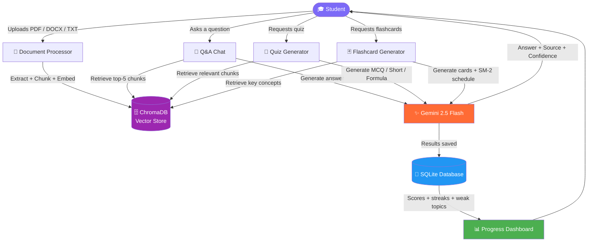
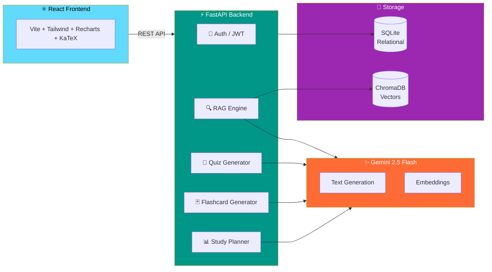

# 🧠 StudyBuddy AI

### AI-Powered Study Assistant for Engineering Students


> Upload your lecture notes and textbooks → Ask questions → Generate quizzes → Study with flashcards → Track your progress. All powered by Gemini AI and RAG.

---

## 📌 What is StudyBuddy?

Most engineering students read their notes passively and forget 70% within a week. StudyBuddy fixes this by turning your static study material into an interactive AI-powered knowledge base.

Upload any PDF, DOCX, or TXT file → StudyBuddy builds a RAG pipeline on top of it → You can ask questions, generate quizzes, and create flashcards — all grounded in your own material, not generic internet knowledge.

---

## 🎬 How It Works — Full Flow



---

## 🏗️ System Architecture



---

## ✨ Features

### 📄 Document Ingestion
- Upload PDF, DOCX, and TXT files
- Semantic chunking — 512 tokens with 64 token overlap
- Gemini embeddings stored in ChromaDB
- Every user gets their own isolated vector store

### 💬 RAG-Powered Q&A Chat
- Answers grounded strictly in your uploaded material
- Source citations — document name and page number on every answer
- Confidence indicator — High / Medium / Low
- Conversation memory — follow-up questions work naturally
- LaTeX formula rendering for engineering equations

### 📝 Quiz Generator
- Three types — MCQ, Short Answer, Formula Recall
- Three difficulty levels — Easy, Medium, Hard
- Gemini evaluates short answers and gives detailed feedback
- Scores saved per topic and feed into progress tracking

### 🃏 Flashcard System
- AI generates flashcards from your uploaded material
- SM-2 spaced repetition algorithm — same as Anki
- Cards scheduled based on how well you know them
- Due-today queue shown on dashboard

### 📊 Progress Dashboard
- Topic accuracy bar chart
- Weak topic detector — flags anything below 60%
- Study streak counter
- Activity heatmap — last 30 days
- Flashcard breakdown — mastered / learning / new / due today

---

## 🔄 RAG Pipeline

1. **Upload** — Student uploads PDF / DOCX / TXT
2. **Extract** — PyMuPDF and python-docx extract text page by page
3. **Chunk** — Text split into 512-token chunks with 64-token overlap
4. **Embed** — Gemini text-embedding-004 converts each chunk to a vector
5. **Store** — Vectors saved in ChromaDB with document name and page metadata
6. **Query** — Student question converted to a query embedding
7. **Retrieve** — Top-5 most similar chunks fetched by cosine similarity
8. **Generate** — Gemini 2.5 Flash generates answer using retrieved chunks as context
9. **Cite** — Every answer shows source document, page number, and confidence score

---

## 📈 Spaced Repetition — SM-2 Algorithm

Flashcards use the SM-2 algorithm — the same one used by Anki:

| Quality | Meaning | What happens |
|---|---|---|
| 0 | Complete blackout | Reset — review tomorrow |
| 1 | Wrong, recognized answer | Reset — review tomorrow |
| 2 | Wrong but easy recall | Reset — review soon |
| 3 | Correct with effort | Interval increases slowly |
| 4 | Correct with hesitation | Interval increases |
| 5 | Perfect recall | Long interval, ease factor goes up |

Ease factor never drops below 1.3. Due cards always shown on dashboard.

---

## 🛠️ Tech Stack

| Layer | Technology | Purpose |
|---|---|---|
| LLM | Gemini 2.5 Flash | Text generation, quiz, flashcards |
| Embeddings | Gemini text-embedding-004 | Document and query vectorization |
| Vector DB | ChromaDB | Semantic similarity search |
| RAG Framework | LangChain | Document chunking pipeline |
| Backend | FastAPI + Python 3.11 | REST API |
| Database | SQLite + SQLAlchemy | Users, quizzes, flashcards, chats |
| Frontend | React 18 + Vite | User interface |
| Styling | Tailwind CSS | Design system |
| Charts | Recharts | Progress visualization |
| Auth | JWT + bcrypt | Secure user sessions |
| PDF Parsing | PyMuPDF | Text extraction from PDFs |
| Spaced Repetition | SM-2 Algorithm | Flashcard scheduling |

---

## 🚀 Getting Started

### Prerequisites
- Python 3.11+
- Node.js 20+
- Gemini API key from [Google AI Studio](https://aistudio.google.com/app/apikey)

### 1. Clone the repository
```bash
git clone https://github.com/Twarit01/StudyBuddy.git
cd StudyBuddy
```

### 2. Backend setup
```bash
cd backend

# Create virtual environment
python3.11 -m venv venv
source venv/bin/activate

# Install dependencies
pip install -r requirements.txt
pip install "pydantic[email]"

# Configure environment
cp .env.example .env
# Open .env and add your GEMINI_API_KEY
```

### 3. Frontend setup
```bash
cd frontend
npm install
```

### 4. Run the application

**Terminal 1 — Backend:**
```bash
cd backend
source venv/bin/activate
uvicorn main:app --reload
```

**Terminal 2 — Frontend:**
```bash
cd frontend
npm run dev
```

### 5. Open in browser
http://localhost:5173

API docs at `http://localhost:8000/docs`

---

## 📁 Project Structure

**Backend** `backend/`
- `core/` — config.py, database.py, auth.py, dependencies.py
- `models/` — user.py, document.py, chat_session.py, quiz_attempt.py, flashcard.py
- `routes/` — auth.py, documents.py, chat.py, quiz.py, flashcards.py
- `services/` — gemini.py, rag.py, document_processor.py, quiz_generator.py, flashcard_generator.py, study_planner.py
- `main.py` — FastAPI app entry point
- `requirements.txt` — Python dependencies
- `.env.example` — Environment variables template

**Frontend** `frontend/src/`
- `pages/` — Login, Register, Dashboard, Chat, Quiz, Flashcards, Progress
- `components/` — Sidebar, FileUpload, SourceCitation, ProtectedRoute
- `api/` — client.js, auth.js, documents.js, chat.js, quiz.js, flashcards.js
- `context/` — AuthContext.jsx
- `hooks/` — useAuth.js, useDocuments.js

**Evaluation** `eval/`
- `ragas_eval.py` — RAG quality testing with RAGAS metrics

---

## 🔑 Environment Variables

```env
GEMINI_API_KEY=your_gemini_api_key_here
SECRET_KEY=your_secret_key_here
ACCESS_TOKEN_EXPIRE_MINUTES=10080
DATABASE_URL=sqlite:///./studybuddy.db
CHROMA_PERSIST_PATH=./vector_store
UPLOAD_DIR=./uploads
ALLOWED_EXTENSIONS=pdf,docx,txt
MAX_FILE_SIZE_MB=50
```

---

## 📊 API Endpoints

| Method | Endpoint | Description |
|---|---|---|
| POST | `/api/auth/register` | Register new user |
| POST | `/api/auth/login` | Login |
| POST | `/api/documents/upload` | Upload study material |
| GET | `/api/documents/` | List all documents |
| DELETE | `/api/documents/{id}` | Delete a document |
| POST | `/api/chat/ask` | Ask a question |
| GET | `/api/chat/sessions` | Get all chat sessions |
| POST | `/api/quiz/generate` | Generate quiz questions |
| POST | `/api/quiz/submit` | Submit quiz and save score |
| POST | `/api/flashcards/generate` | Generate flashcards |
| POST | `/api/flashcards/{id}/review` | Submit SM-2 review |
| GET | `/api/flashcards/due` | Get cards due today |
| GET | `/api/flashcards/stats` | Get flashcard statistics |

---

## 🤝 Contributing

1. Fork the repository
2. Create a feature branch `git checkout -b feature/your-feature`
3. Commit your changes `git commit -m 'Add your feature'`
4. Push to branch `git push origin feature/your-feature`
5. Open a Pull Request

---